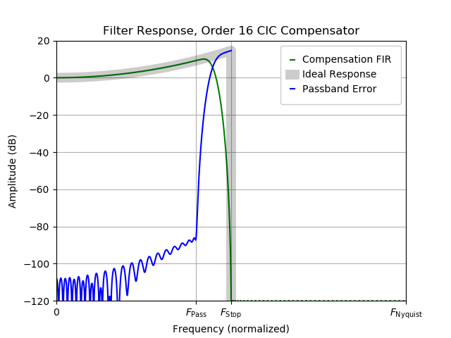
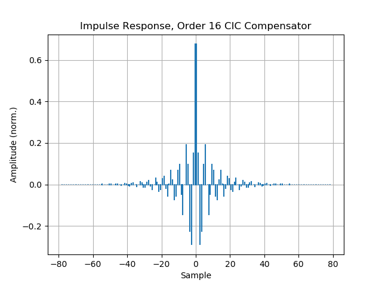

Designing CIC Compensation Filters
==================================

.. note::
        The following content is taken from a blog post on
        http://threespeedlogic.com. BitBucket's support for
        RST directives (such as equations) is limited, so the
        formatting may suffer here.

This page describes how to design CIC compensation filters using open-source
tools. Due to the use of newer algorithms, compensators designed using this
method should outperform MATLAB's built-in "ciccomp" filters.

A Little Motivation
-------------------

Occasionally, DSP designers need to build decimators.

|

Here, the goal is to remove high-frequency content from a sampled data source,
producing a new sequence of data samples at a lower sampling rate.

From a theoretical perspective, the canonical approach to decimation is to use
a Finite Impulse Response (FIR) filter. FIR decimators are well-understood,
well-behaved, and approachable. FIR design is mature, and there exists a
canonical FIR design tool (the [Parks-McClellan]_ or Remez algorithm) that
makes it straightforward to turn a filter specification into a set of FIR
coefficients.  Implementations of this algorithm are available in Python/Scipy
and MATLAB. More recent work has produced variations on the algorithm with
better convergence [Filip]_.

From a practical perspective, a naive implementation of a FIR decimator (that
is, a FIR followed by a decimation stage) is computationally inefficient.
Here, too, there's an obvious path to follow. Polyphase techniques
[Vaidyanathan]_ can be used to decompose a single, large FIR into a set of
parallel FIRs operating at a reduced data rate.

As flexible and useful as FIR decimators are, there are a few corner cases
where they don't produce adequate designs:

* When the decimation ratios involved are very high, the number of FIR
  coefficients needed to meet performance requirements grows.  Even if the
  Parks-McClellan algorithm does converge to an usable FIR, the resulting
  coefficient vector may be impractical to use even after polyphase
  decomposition.
* When memory (coefficient and signal buffers) is very highly constrained (i.e.
  in an FPGA, or when processing many signals in a design.) The polyphase
  decomposition reduces the computational burden associated with the FIR, but
  does nothing for the amount of memory required.
* When an FIR does not offer adequate flexibility (see, for example, the
  variable-sampling-rate trick described below.)

In these situations, a CIC is an interesting alternative.

Introducing the CIC Filter
--------------------------

A CIC, or Cascaded Integrator-Comb, is a filter that's much more restrictive
than an FIR. It has a very wide transition region and is only really effective
as an anti-aliasing filter for very narrowband signals. However, it's
computationally extremely efficient (it requires only adders and registers, and
relatively few of each) and its shortcomings can be corrected. When paired with
a conventional FIR, the resulting compound decimator plays to the strengths of
each.

|

The original CIC paper [Hogenauer]_ is among my favourite DSP references. It is
well written and approachable, and revolves around a single mathematical trick
so filthy it's genuinely worth celebrating. Please stop here and go find read
the original paper.

Assuming you have skimmed the original CIC paper, I will now pull out several
tidbits.  (Note that I'm focused on decimators, here, but there is always a
dual development that applies equally to interpolators.)

In the following, we assume the compound decimation structure shown above, in
which large decimation factors are dealt with by the CIC. The FIR exists only
to compensate or "clean up" passband droop imposed by the CIC, and decimates by
a final factor of 2 because it is convenient and efficient to do so.

A Magic Trick: Small-Angle Approximation
----------------------------------------

The amplitude response for a CIC decimator is (using the notation from
[Hogenauer]_):

$$A(f) = \\left[ \\frac{\\sin (\\pi M f)}{\\sin \\left( \\frac{\\pi f}{R}\\right)} \\right]^N$$

The terms in this equation are defined as follows:

- :math:`N` is the number of stages in the CIC filter,
- :math:`M` is a differential delay (a tunable parameter, though I only ever use 1),
- :math:`R` is the CIC's rate-change parameter, and
- :math:`f`, here, is a normalized frequency in which 0.5 corresponds to the Nyquist rate.

Hogenauer notes the small-angle approximation for the denominator term:

$$\\newcommand{\\sinc}{\\mathop{\\rm sinc}\\nolimits}
A(f) \\approx \\left[ RM \\right]^N \\sinc^N(\\pi M f)$$

where :math:`\sinc(x) = \sin (\pi x)/(\pi x)`.

Let's assume our compensation filter will only correct the frequency-dependent
portions of this expression. (When :math:`[RM]^N` is a power of 2, as they are
in my case, these gains are typically corrected using bit shifts, which are
free in an FPGA.) We are left with the frequency-dependent portion of the
expression

$$\\sinc^N \\left( \\pi M f \\right)$$

To correct for this amplitude droop, the FIR must impose the inverse gain
on its passband:

$$C(f) = \\sinc^{-N}(\\pi Mf)$$

for :math:`f` over a passband extending as high as the normalized frequency 1/4
(that is, the Nyquist rate at the FIR's output, remembering that it is also has
a decimation-by-2 rate change function.) In reality, the filter's passband edge
must be relaxed below the Nyquist rate to introduce a transition region,
allowing the filter's design to be tractable.

*The decimation rate R does not appear in this expression*! That is, provided
the small-angle approximation is appropriate, a single single, fixed
compensation FIR will suffice for any CIC decimation rate. This provides an
easy way to build a signal path that's adaptable to multiple operating
scenarios without being redesigned each time.

We have motivated the need for a compensating filter, and proposed a structure
for it. We have also calculated the required passband amplitude to correct for
droop in the CIC's passband. We are finally ready to calculate it.

Compensating CIC Filters
------------------------

Of the dominant signal-processing packages, unfortunately, only MATLAB provides
`the necessary machinery
<https://www.mathworks.com/help/dsp/ref/fdesign.ciccomp.html>`_ to create a
CIC compensator FIR "out-of-the-box". In the past, I have managed to scrounge
up a MATLAB installation in the rare case I need it. However, my lab shifted
wholesale to Python a decade ago, and I'm otherwise completely MATLAB-free.
Sorry, Mathworks, it's time to move on.

Here are a few open-source Parks-McClellan or Remez implementations:

* `Octave-forge's Remez implementation <https://octave.sourceforge.io/signal/function/remez.html>`_
* `Python's scipy.signal library <https://docs.scipy.org/doc/scipy/reference/generated/scipy.signal.remez.html>`_
* `Silviu-Ioan Filip's stability improvements <https://github.com/sfilip/firpm>`_
* `An inverse-sinc filter tutorial from Liquid SDR <https://liquidsdr.org/blog/firdespm-invsinc/>`_
* `The original FORTRAN code <http://michaelgellis.tripod.com/dsp/pgm21.html>`_

Unfortunately, none of these implementations is suitable on its own. The Liquid
SDR implementation allows a callback to inject the desired amplitude responses
:math:`C(f)`; however, this implementation did not converge well enough for me
to use it. Where other implementations of the Parks-McClellan algorithm
admitted a stepwise or piecewise-linear approximation to :math:`C(f)`,
experiments with this approach were far too brittle to produce usable results.

I was, however, able to add a callback-enabled version of Silviu-Ioan Filip's
code.

The Solution
------------

I began with the source code here:

|    https://github.com/sfilip/firpm [Filip]_
|

This code contains three implementations of an extended Parks-McClellan
algorithm: two using underlying C types (:code:`double` and :code:`long
double`), and one using an arbitrary-precision library (Pavel Holoborodko's
excellent `C++ wrappers <http://www.holoborodko.com/pavel/mpfr>`_ for the also
excellent `GNU MPFR <https://www.mpfr.org/>`_ library.) I opted for the third,
since I am more interested in limiting developer commitment than maximizing
computational efficiency.

(As an aside, this code would benefit greatly from some refactoring by an
experienced C++ developer.)

My modifications are contained in a new repository here:

|    https://bitbucket.org/gsmecher/ciccomp
|

|

|

Enjoy!

References
----------

The following links are often behind IEEE's paywall. However, the papers
referenced here are "classics" and are easily available with a little creative
searching. Both the [Vaidyanathan]_ and [Hogenauer]_ references are among my
all-time favourites for both content and presentation.

.. [Vaidyanathan] P.P. Vaidyanathan, "Multirate Digital filters, filter banks,
        polyphase networks, and applications: a tutorial". In Proc. IEEE, vol. 78, Jan. 1990.
        https://ieeexplore.ieee.org/document/52200)

.. [Hogenauer] E. Hogenauer, "An Economical Class of Digital Filters for Decimation and
        Interpolation". In IEEE Trans. Acoustics, Speech, and Signal Processing, vol. 29,
        Apr. 1981. https://ieeexplore.ieee.org/document/1163535

.. [Parks-McClellan] J.H.McClellan and T.W.Parks, "A Personal History of the Parks-McClellan
        Algorithm". In IEEE Signal Processing Magazine, vol. 22, Mar. 2005.
        https://ieeexplore.ieee.org/document/1406492

.. [Filip] Silviu-Ioan Filip, "A Robust and Scalable Implementation of the
        Parks-McClellan Algorithm for Designing FIR Filters". In ACM Trans. Mathematical Software,
        Vol. 43, Aug. 2016. https://dl.acm.org/citation.cfm?id=2904902
